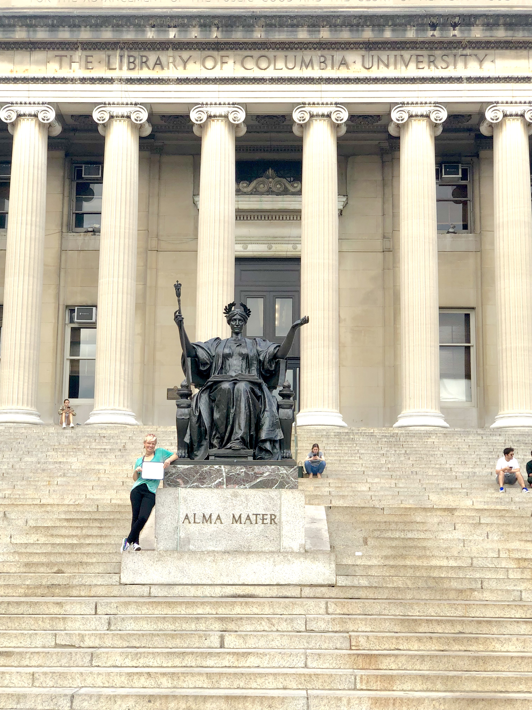

I did it! I graduated from Columbia University with a certificate in Full-Stack Web Development! 

It was 6 months of class 3 days a week, a full-time job and a shift in my role at that job, a second part-time job, and all of it to come out the other side as a true blue Programmer.

My inner nerd is out of hiding, and I'm proud of her!

Though I took a Full Stack course, in the end my first love is still Front End design. CSS and Javascript are like my playgrounds that I just can't get enough play date time with them! I am so happy I have React and React Native under my belt as well as a true understanding of the back end data. 

Demo Day is coming after an upcoming arduous October! I'll keep my head up and power through.
