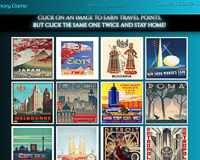
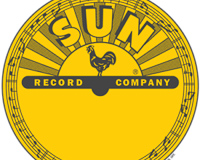
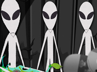

[row]
[col]

[Play the Game](https://bleauwonder.github.io/matching-cities-game/ "Art Deco Memory Game")
[See the Code](https://github.com/bleauwonder/Art-Deco-game/ "See the Code")
A React game enhanced by Bootstrap, CSS, and Javascript. See if you can earn the most travel points!

Tech: React, Bootstrap, CSS, Javascript

[/col]

[col]

[Play the Game](https://salty-sea-60327.herokuapp.com/ "Cartoon Friend Finder")
[See the Code](https://github.com/bleauwonder/CartoonFriendFinder "See the Code")

An Express and Node Application with a survey so you can find your Cartoon Best Friend

Tech: HTML, Bootstrap, CSS; Express, Node.js, AJAX

[/col]
[/row]

[row]
[col]

[Play the Game](https://bleauwonder.github.io/TriviaGame/ "Sun Records Trivia Game")
[See the Code](https://github.com/bleauwonder/TriviaGame "See the Code")

Test your Trivia Skills about the famous Sun Records label! 
Tech: HTML, CSS and Javascript
[/col]

[col]

[Play the Game](https://bleauwonder.github.io/makin-hot-sauce/ "Makin' Hot Sauce")
[See the Code](https://github.com/bleauwonder/makin-hot-sauce "See the Code")

Test your skills against the computer in a peppery game like 21. 
Tech: HTML, CSS, Javascript 
[/col]
[/row]

[row]
[col]

[Play the Game](https://bleauwonder.github.io/Word-Guess/ "Aliens in Pop Culture")
[See the Code](https://github.com/bleauwonder/Word-Guess "See the Code")

An Alien-themed Word Guess game. Dive back in like Molder and Skully to see what you know.   

Tech: HTML, CSS, Javascript 
[/col]
[/row]
