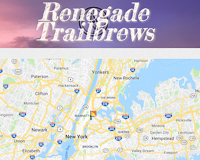

Full-Stack, Back-End, and Front-End Applications

[row]
[col]

[See it in Action](https://meey-project2.herokuapp.com/ "GuestLister")
[See the Code](https://github.com/bleauwonder/GuestLister "See the Code")

A Full-Stack Application that allows for automatic notifications in event planning, including during check-in
Tech: Bootstrap, Handlebars, CSS; Sequelize, Mailgun, Express, Node.js, Mocha, Chai

[/col]
[col]

[See it in Action](https://dry-cliffs-88051.herokuapp.com/ "Party Planner")
[See the Code](https://github.com/bleauwonder/partyplanner "See the Code")

Planning a party? Have a ball with this retro 90s looking task planner and get that party planned. A Full-Stack Application
Tech: Handlebars, Javascript, CSS; Express, Node.js, mySQL, ORM

[/col]
[/row]

[row]
[col]

[See it in Action](https://bleauwonder.github.io/renegades-of-silicon-alley/ "Renegade Trailbrews")
[See the Code](https://github.com/bleauwonder/renegades-of-silicon-alley "See the Code")

A Front-End Application with the help of Firebase on the backend. A prototype of an application for outdoor-lovers
Tech: HTML, Materialize, CSS, Javascript, Firebase, Google API, Hiking Project API, OpenBrewerydb API

[/col]

[col]

[See it in Action](https://bleauwonder.github.io/Giphy-Time/ "I Love Sitcoms API")
[See the Code](https://github.com/bleauwonder/Giphy-Time "See the Code")

A Front-End Application for having fun with gifs of sitcoms! 
Tech: HTML, CSS, Bootstrap, Javascript, Giphy API, OMDB API
[/col]
[/row]
