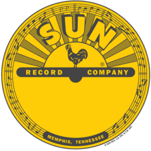
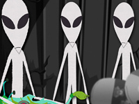

Games are partly what drew me to dive into programming. Creating the trivia, themes, and javascript logic are all part of the fun. 

[row]
[col]

A React game enhanced by Bootstrap, CSS, and Javascript. See if you can earn the most travel points!

Tech: React, Bootstrap, CSS, Javascript

[/col]
[col]

Test your Trivia Skills about the famous Sun Records label! 

Tech: HTML, CSS and Javascript

[/col]
[/row]

[row]
[col]

Test your skills against the computer in a peppery game like 21. 

Tech: HTML, CSS, Javascript 

[/col]
[/row]

[row]
[col]

An Alien-themed Word Guess game. Dive back in like Molder and Skully to see what you know.   

Tech: HTML, CSS, Javascript 

[/col]
[/row]
