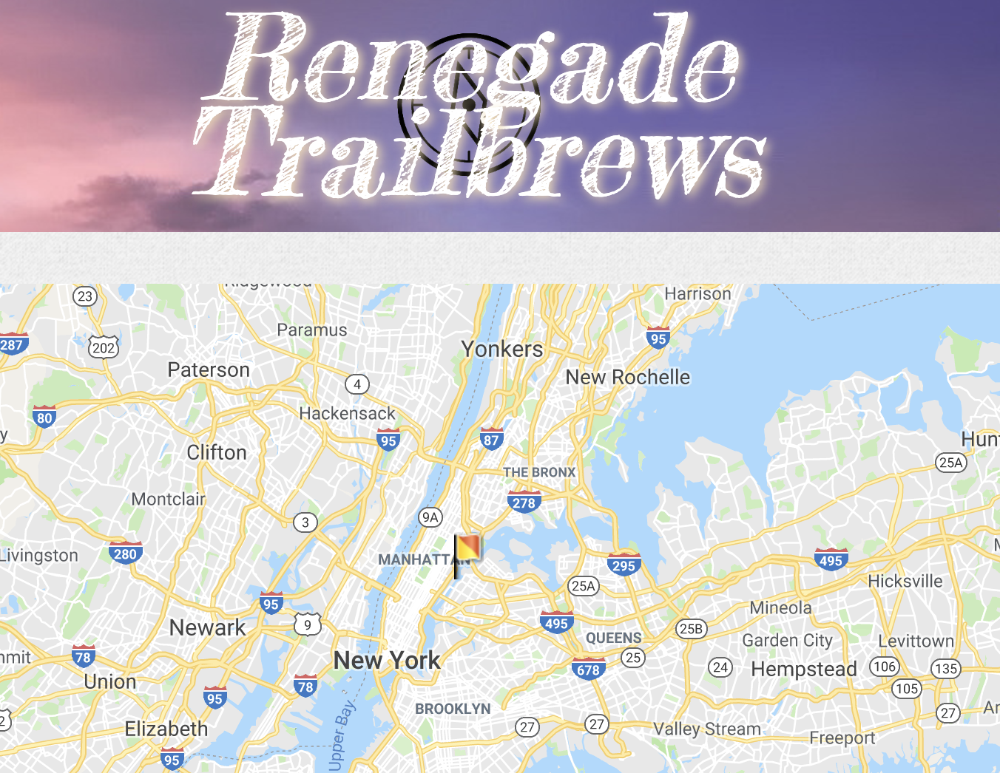

Full-Stack, Back-End, and Front-End Applications

[row]
[col]

A Full-Stack Application that allows for automatic notifications in event planning, including during check-in
Tech: Bootstrap, Handlebars, CSS; Sequelize, Mailgun, Express, Node.js, Mocha, Chai

[/col]
[col]

Planning a party? Have a ball with this retro 90s looking task planner and get that party planned. A Full-Stack Application
Tech: Handlebars, Javascript, CSS; Express, Node.js, mySQL, ORM

[/col]
[/row]

[row]
[col]

A Front-End Application with the help of Firebase on the backend. A prototype of an application for outdoor-lovers
Tech: HTML, Materialize, CSS, Javascript, Firebase, Google API, Hiking Project API, OpenBrewerydb API

[/col]
[/row]

[row]
[col]

A Front-End Application for having fun with gifs of sitcoms! 
Tech: HTML, CSS, Bootstrap, Javascript, Giphy API, OMDB API

[/col]

[/row]
